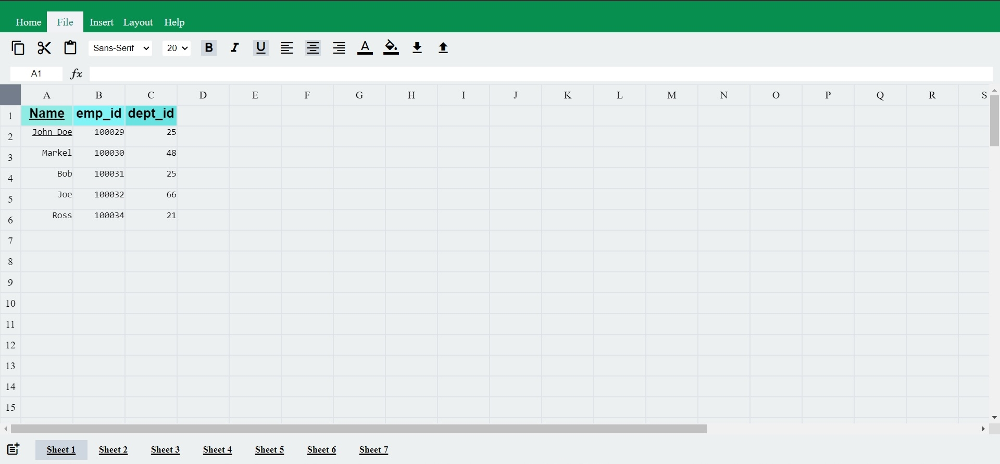

## Sheets-Clone 📰📰💥
- This is a sheets clone project, which is a free web-based spreadsheet editor provided by google.
-------
### Key Features 🧩🧩
- Heavy CSS(Clean UI)
- Heavy DOM
- Two way binding (Manipulation in both UI & storage(cell properties))
- Formula Evaluation
  - Cycle validation (Graph Algo for cycle detection)
- Cycle validation color tracking (using asynchronous JS)
  - setTimeout() and promise are used
  - use of async await
- Storage of the files using 2D matrix
  - 2D matrix with objects
- Multiple sheets handling
- Custom cut copy paste buttons
-------
### Preview 📌📌

-------

